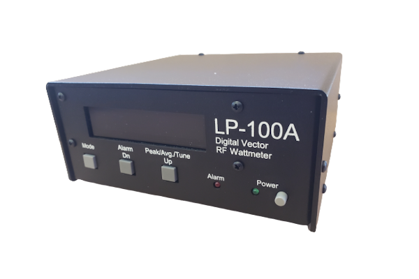
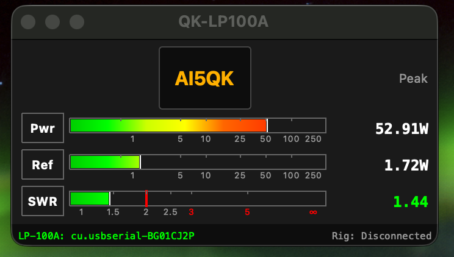
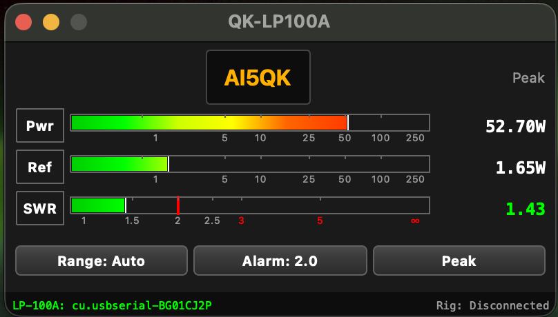
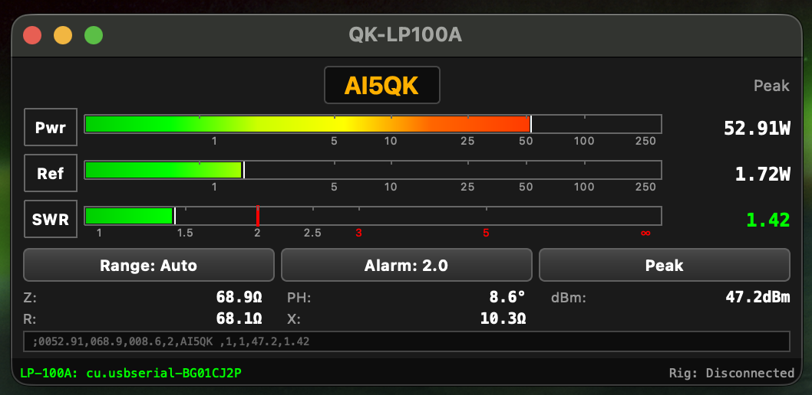
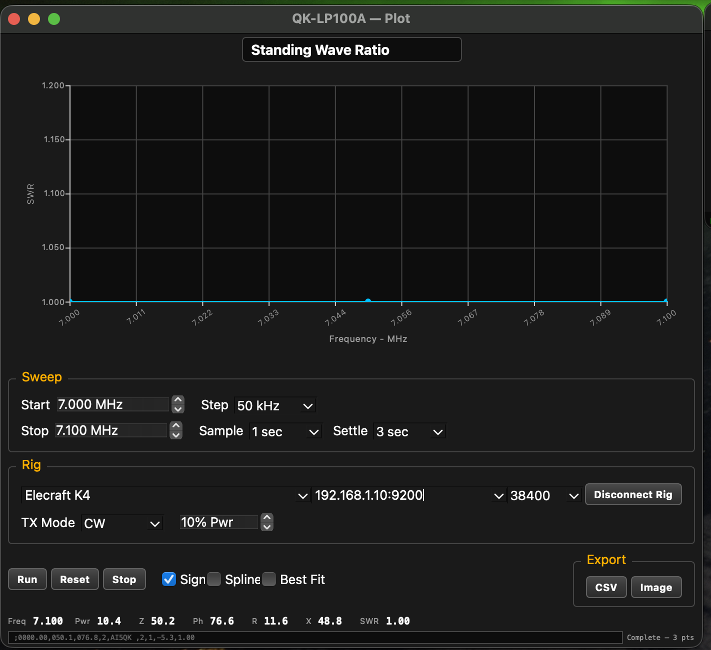
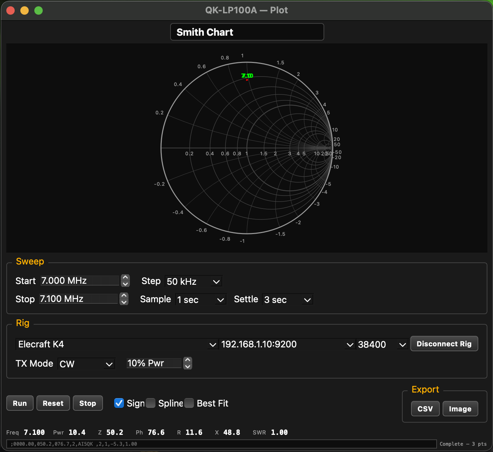

# QK-LP100A

Real-time power, SWR, and impedance monitoring for the TelePost LP-100A Digital Vector RF Wattmeter — native macOS, Apple Silicon.



## Download

**[Get the latest signed, notarized DMG → mikeg-dal.github.io/QK-LPA100A](https://mikeg-dal.github.io/QK-LPA100A/)**

One download. Drag to Applications. Launch. Qt, Hamlib, libusb, OpenSSL and every other dependency are bundled inside the app. No Homebrew, no separate installs, no terminal commands required.

## What it does

**VCP mode** — real-time power, reflected, and SWR gauges with impedance readout, connected to the LP-100A over USB serial or TCP.

**Plot mode** — automated antenna frequency sweeps using Hamlib rig control, charting power, SWR, and impedance across the band (Smith chart included).

## View Styles

<table>
  <tr>
    <td align="center" width="33%"><br><sub><b>Compact</b> &mdash; gauges only</sub></td>
    <td align="center" width="33%"><br><sub><b>Standard</b> &mdash; + Range / Alarm / Peak</sub></td>
    <td align="center" width="33%"><br><sub><b>Full</b> &mdash; + impedance &amp; dBm</sub></td>
  </tr>
</table>

Switch layouts anytime from the View menu.

## Plot Mode — Antenna Sweeps

Drive any Hamlib-supported rig across a frequency range and chart SWR, power, and impedance in real time.

<table>
  <tr>
    <td align="center" width="50%"><br><sub><b>SWR vs Frequency</b> &mdash; auto-scaled plot with sign-corrected values</sub></td>
    <td align="center" width="50%"><br><sub><b>Smith Chart</b> &mdash; impedance locus with labeled frequency points</sub></td>
  </tr>
</table>

Export the trace as CSV or PNG with one click.

## Requirements

- macOS 26 (Tahoe) or later
- Apple Silicon (M1 or newer)

## Build from source (optional)

Developers can build locally with Qt 6.10.1 + Hamlib + Ninja:

```bash
qt-cmake -S . -B build -G Ninja
ninja -C build
open build/QK-LP100A.app
```

See `CMakeLists.txt` and `.github/workflows/build-macos.yml` for the exact toolchain the signed release uses.

## Links

- [Project site & downloads](https://mikeg-dal.github.io/QK-LPA100A/)
- [YouTube — AI5QK](https://www.youtube.com/@AI5QK)
- [Open issues](https://github.com/mikeg-dal/QK-LPA100A/issues)

---

&copy; 2025-2026 Mike Garcia &mdash; AI5QK
